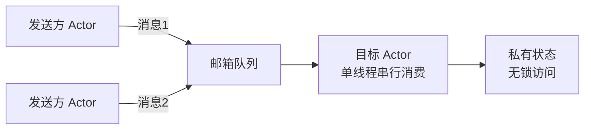

# Actor模型详细介绍

> **Workspace:** d:\devFile\ai\code\github\xiaozhi-esp32-server-java

---

**User**

`d:\devFile\ai\code\github\xiaozhi-esp32-server-java/docs\Java线程模型与模式概览.md`  详细介绍一下里面提到的Actor 模型

**Assistant**

我先快速定位一下项目中与 Actor 模型对应的核心实现（Player、Session），以便结合项目实际讲解。

# Actor 模型详解

文档 [Java线程模型与模式概览.md](file:///d:/devFile/ai/code/github/xiaozhi-esp32-server-java/docs/Java线程模型与模式概览.md) 的 2.9 节将 Actor 模型定位为"消息驱动、无共享状态"的并发范式，并指出本项目 `ScheduledPlayer` 是其"无框架雏形"。下面从理论、实现、项目落地三个层面展开。

---

## 1. 理论起源与定位

Actor 模型由 Carl Hewitt 于 1973 年提出（比 Java 诞生早了 20 年），其工程上的巅峰验证是 **Erlang/OTP**——爱立信用它做到了电话交换系统 "99.9999999% 可用性"（9 个 9，即一年宕机不超过 31 毫秒）。

它要解决的根本问题是：**共享内存 + 锁的并发模型既难写对，又难扩展到多机**。

```java
// 传统共享内存模型：状态被所有线程可见，必须靠锁保护
class Counter {
    private int count = 0;                    // 共享可变状态
    public synchronized void inc() { count++; }  // 忘加锁/加错锁 = 数据竞争
}
```

Actor 模型的答案是：**干脆不共享**。每个 Actor 独占自己的状态，外界只能发消息，不能直接读写。

---

## 2. 核心概念与三大公理

### 2.1 Actor 是什么

一个 Actor 是**状态 + 行为 + 邮箱（mailbox）+ 地址（address）** 的封装体：



### 2.2 Hewitt 三大公理

当一个 Actor 收到消息时，它可以**同时**做三件事：

1. **发送有限条消息**给其他 Actor（异步，不等待）
2. **创建有限个新 Actor**
3. **改变自身状态**（处理下一条消息时可见）

这三条公理推出了两个关键结论：

- **无锁（lock-free）**：每个 Actor 串行处理自己的邮箱，同一时刻只有一个"逻辑线程"触碰它的状态，天然线程安全，不需要 `synchronized`。
- **位置透明（location transparency）**：Actor 之间只通过地址通信，消息发往本进程还是远程机器，代码写法完全一样——这是 Actor 天然适合分布式的根本原因。

### 2.3 消息语义

| 语义 | 说明 |
|------|------|
| 异步 fire-and-forget | `tell`（`!`）发送后立即返回 |
| 请求-响应 | `ask`（`?`）返回一个 Future，本质是约定回信地址的两次 tell |
| 投递保证 | 默认 **at-most-once**（最多一次），分布式下可能丢消息 |
| 顺序保证 | 同一发送方 → 同一接收方的消息**保序**（Akka 保证，Erlang 不跨节点保证） |
| 消息不可变 | 消息必须是不可变对象，否则"无共享"承诺被击穿 |

---

## 3. 生命周期与监督（Supervision）—— Actor 模型的精髓

Actor 呈**树形结构**，父节点监督子节点。子 Actor 抛异常时，由父 Actor 的**监督策略**决定处置方式，而不是让异常蔓延：

| 策略 | 含义 | 适用 |
|------|------|------|
| `restart` | 丢弃旧实例、保留邮箱、重建状态 | 临时性故障（网络抖动） |
| `resume` | 忽略异常，继续处理下一条消息 | 可容忍的错误 |
| `stop` | 永久终止该 Actor | 不可恢复的故障 |
| `escalate` | 自己也失败，向上层监督者传递 | 无法本地决策 |

两种作用域：
- **One-for-One**：只处置出错的子节点
- **All-for-One**：一个子节点出错，处置所有兄弟节点（适合兄弟间状态强耦合的场景）

这套"let it crash"哲学是 Erlang/OTP 高可用的核心：**与其在代码里到处 try-catch 修补脏状态，不如快速崩溃、干净重启**。

---

## 4. Java 生态的实现版图

| 实现 | 特点 | 现状 |
|------|------|------|
| **Akka Classic** | untyped Actor，`AbstractActor` + `receiveBuilder`（即文档 2.9 的示例） | Akka 2.6 起进入维护模式 |
| **Akka Typed** | 类型安全 API，行为即函数 `(State, Message) -> Behavior` | 2022 后 Akka 改 BSL 商业许可 |
| **Apache Pekko** | Akka 2.6.20 的社区分叉（阿里主导） | 开源替代品，API 兼容 |
| **Vert.x EventBus** | 轻量消息驱动，非严格 Actor（无监督树） | 适合事件总线场景 |
| **Quasar/Kilim** | 早期"绿色线程 + 挂起"方案 | 已被 Loom 取代 |

### 4.1 Akka Typed 示例（现代写法）

```java
// 行为 = 消息处理函数，状态通过参数传递而非字段——函数式风格
public class DeviceActor {
    public static Behavior<AudioFrame> create(DeviceState state) {
        return Behaviors.receive(AudioFrame.class)
            .onMessage(AudioFrame.class, (ctx, frame) -> {
                DeviceState newState = state.process(frame);   // 状态转换
                return create(newState);                       // 返回下一个行为
            })
            .onSignal(PreRestart.class, sig -> {
                log.warn("Actor 重启，保留邮箱继续处理");
                return Behaviors.same();
            })
            .build();
    }
}

// 使用：只拿到 ActorRef（地址），永远无法直接触碰内部状态
ActorRef<AudioFrame> ref = ctx.spawn(DeviceActor.create(initialState), "device-42");
ref.tell(new AudioFrame(payload));   // 异步投递，立即返回
```

---

## 5. Actor vs 其他模型（横向对比）

| 维度 | Actor | CSP（Go channel/Kotlin 协程） | 共享内存+锁 |
|------|-------|------------------------------|-------------|
| 通信载体 | 具名邮箱（多对多） | 匿名 channel（可传递） | 无，靠同步原语 |
| 状态归属 | 状态**属于** Actor | 状态在 goroutine 内但非强制 | 全局共享 |
| 耦合方式 | 发送方需知道接收方地址 | channel 解耦收发双方 | 全员耦合 |
| 分布式 | 原生支持（ActorRef 跨节点寻址） | 需额外设施（如 NATS） | 极难 |
| 错误处理 | 监督树、let it crash | panic/recover | try-catch 传染 |
| 实现代表 | Erlang/OTP、Akka/Pekko | Go、Kotlin 协程、Rust async | Java 传统并发 |

一句话区分：**Actor 是"有身份的对象 + 邮箱"；CSP 是"无身份的进程 + 通道"**。Actor 耦合的是地址，CSP 耦合的是 channel 本身。

---

## 6. 本项目的"无框架 Actor"—— ScheduledPlayer 解构

文档说本项目是"Actor 雏形"，这不是客套。逐条对照 [ScheduledPlayer.java](file:///d:/devFile/ai/code/github/xiaozhi-esp32-server-java/xiaozhi-dialogue/src/main/java/com/xiaozhi/dialogue/playback/ScheduledPlayer.java)：

| Actor 公理/机制 | ScheduledPlayer 中的对应物 | 代码位置 |
|----------------|---------------------------|---------|
| **私有状态**（无锁访问） | `playPosition`、`startTimestamp` 等播放状态，仅由发送线程修改 | [ScheduledPlayer.java:L60-L61](file:///d:/devFile/ai/code/github/xiaozhi-esp32-server-java/xiaozhi-dialogue/src/main/java/com/xiaozhi/dialogue/playback/ScheduledPlayer.java#L60-L61) |
| **邮箱（mailbox）** | `ConcurrentLinkedQueue<Speech> allOpusFrames` + `fluxQueue`（两级邮箱） | [ScheduledPlayer.java:L67-L70](file:///d:/devFile/ai/code/github/xiaozhi-esp32-server-java/xiaozhi-dialogue/src/main/java/com/xiaozhi/dialogue/playback/ScheduledPlayer.java#L67-L70) |
| **单线程串行消费** | `Thread.startVirtualThread(this::sendFramesLoop)` —— 每个 Player 独占一个虚拟线程，天然免锁 | [ScheduledPlayer.java:L97](file:///d:/devFile/ai/code/github/xiaozhi-esp32-server-java/xiaozhi-dialogue/src/main/java/com/xiaozhi/dialogue/playback/ScheduledPlayer.java#L97) |
| **异步消息（tell）** | `play(Flux)` 不阻塞调用方，只入队后立即返回；调用方（STT/LLM 链路）继续跑 | [ScheduledPlayer.java:L78-L103](file:///d:/devFile/ai/code/github/xiaozhi-esp32-server-java/xiaozhi-dialogue/src/main/java/com/xiaozhi/dialogue/playback/ScheduledPlayer.java#L78-L103) |
| **响应消息（改变行为）** | `SENTENCE_GAP_MARKER` 哨兵消息——发送循环收到它就推进 playPosition 跳过一帧间隔，相当于"消息驱动状态机跳转" | [ScheduledPlayer.java:L224-L229](file:///d:/devFile/ai/code/github/xiaozhi-esp32-server-java/xiaozhi-dialogue/src/main/java/com/xiaozhi/dialogue/playback/ScheduledPlayer.java#L224-L229) |
| **终止（stop）** | `stop()` 中断线程、清空邮箱、dispose 上游订阅——即 Actor 的 `PoisonPill` 语义 | [ScheduledPlayer.java:L328-L357](file:///d:/devFile/ai/code/github/xiaozhi-esp32-server-java/xiaozhi-dialogue/src/main/java/com/xiaozhi/dialogue/playback/ScheduledPlayer.java#L328-L357) |
| **每实例一 Actor** | 每个 `ChatSession` 持有自己的 Player（经 [DialogueContext.java:L57](file:///d:/devFile/ai/code/github/xiaozhi-esp32-server-java/xiaozhi-dialogue/src/main/java/com/xiaozhi/dialogue/runtime/DialogueContext.java#L57) 引用），设备间互不干扰 | DialogueContext |

**它缺什么（即"雏形"的含义）**：
1. **没有监督树** —— 播放线程崩溃后不会自动重启，只能靠 `abortDialogue()` 外部清理
2. **没有位置透明** —— 邮箱是进程内队列，无法跨 dialogue 实例通信（跨实例要走 Redis Pub/Sub）
3. **投递语义未管理** —— 无 at-most-once/at-least-once 约定，打断时清队列 = 直接丢消息

这也解释了文档 ADR 的选择：引入 Akka/Pekko 的收益（监督、分布式）不足以抵消框架绑定成本，**虚拟线程 + 队列用 1/10 的复杂度拿到了 Actor 70% 的好处**（无锁、串行化、高并发）。这正是 JDK 21 之后的典型权衡。

---

## 7. 选型建议：何时真正需要 Actor 框架

```
需要 Actor 框架（Pekko/Akka）           用"虚拟线程 + 队列"自建即可
─────────────────────────────         ─────────────────────────────
✓ 状态需要跨进程/跨节点分布              ✓ 状态只在本进程内
✓ 需要监督树做故障自愈                  ✓ 故障可由上层统一清理
✓ 消息吞吐达百万级/秒                   ✓ 每秒数千至数十万
✓ 需要 event sourcing / persistence    ✓ 状态可重建（本项目: Player 状态可丢弃）
✓ 长生命周期有状态实体（设备/订单）       ✓ 短生命周期任务编排
```

对本项目而言，如果未来设备数达到十万级且需要**跨 dialogue 实例迁移会话**（有状态故障转移），那时的演进方向可能是：保留虚拟线程执行模型，但引入 Pekko 的 Cluster Sharding 管理设备 Actor 的分布——两者的结合点恰恰是 Loom 之后 Actor 框架的新定位：**只取其"编址与监督"，并发执行交给虚拟线程**。

---

需要我进一步展开某个方向吗？例如：监督策略在 `DialogueService.abortDialogue()` 中的等价实现分析，或 Pekko Cluster Sharding 在 dialogue 水平扩展中的可行性评估。

---

