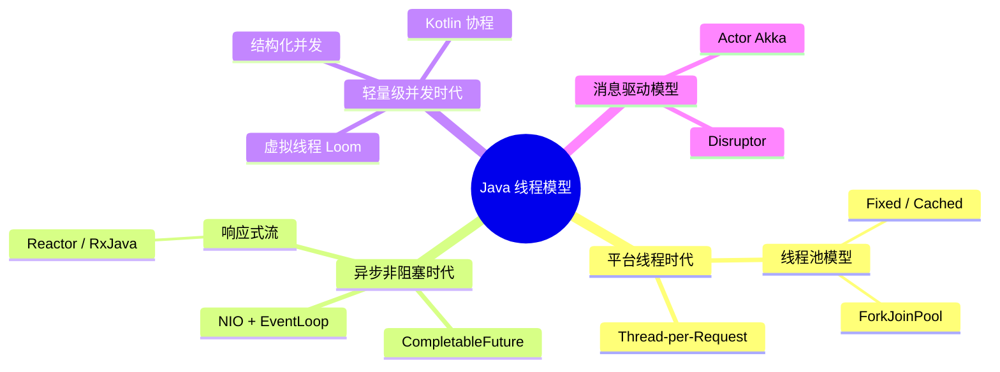
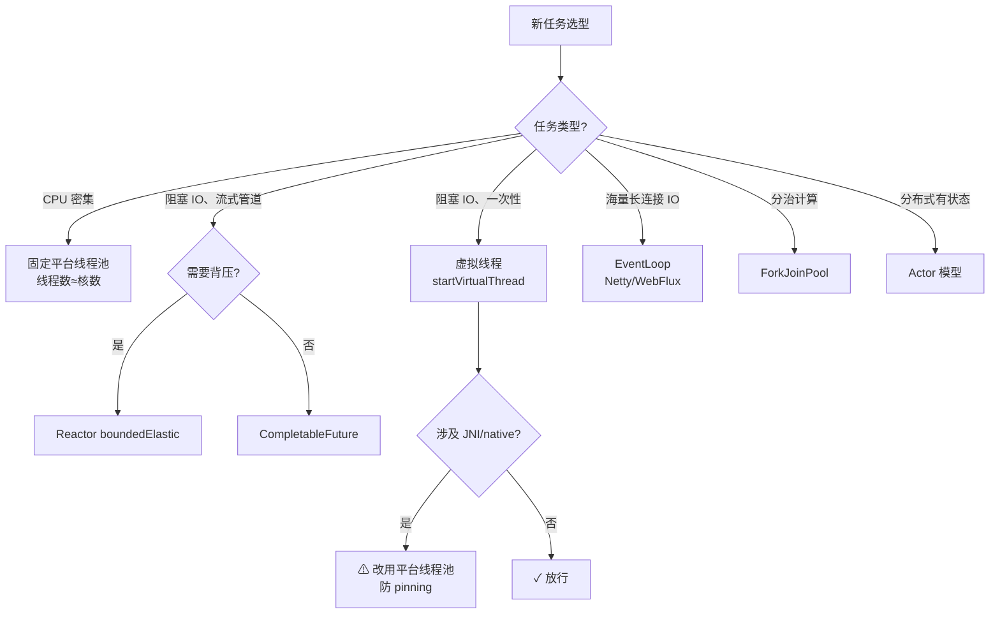

# Java 生态线程模型与模式概览

> 姊妹篇：[线程模型架构设计.md](线程模型架构设计.md)（本项目的具体落地）
> 本文视野：Java 生态中全部主流线程模型 / 并发模式，作为技术选型参考

---

## 1. 总览：六大线程模型谱系



---

## 2. 各模型详解

### 2.1 Thread-per-Request（一请求一线程）

**时代**：Servlet 2.x / 传统 Bio 服务器

```java
// 每个 HTTP 请求分配一个 OS 线程，处理完销毁
new Thread(() -> handleRequest(socket)).start();
```

| 维度 | 说明 |
|------|------|
| 编程模型 | 同步阻塞，直觉最好 |
| 瓶颈 | OS 线程 ≈ 1MB 栈 + 上下文切换开销，单机上限数千 |
| 现状 | 已被线程池取代；虚拟线程本质是它的"复活" |

### 2.2 线程池模型（JDK 5, `java.util.concurrent`）

```java
ExecutorService pool = new ThreadPoolExecutor(
    core, max, keepAlive, unit,
    new LinkedBlockingQueue<>(),   // 有界队列 + 拒绝策略
    new ThreadFactoryBuilder().setNameFormat("biz-%d").build());
```

**内部结构**：`ThreadPoolExecutor = 核心线程 + 弹性线程 + 阻塞队列 + 拒绝策略`

**变体与适用**：

| 池类型 | 特征 | 适用场景 |
|--------|------|---------|
| `newFixedThreadPool` | 固定线程 + 无界队列 | CPU 密集，线程数 ≈ 核数 |
| `newCachedThreadPool` | 0~∞ 线程 + SynchronousQueue | 短生命周期 I/O 任务（本项目的 AliyunTtsService 即此变体） |
| `newSingleThreadExecutor` | 单线程保证顺序 | 日志/心跳类任务（本项目心跳调度器） |
| `newScheduledThreadPool` | 周期/延迟执行 | 定时任务 |
| `newWorkStealingPool` | ForkJoinPool + 工作窃取 | 分治计算 |

**经验法则**：
- CPU 密集：线程数 = 核数 + 1
- I/O 密集：线程数 = 核数 × (1 + 等待时间/计算时间)

### 2.3 ForkJoinPool 与工作窃取（JDK 7）

```java
// 每个线程有自己的双端队列：自己从头部取，空闲时从别人尾部"偷"
ForkJoinPool pool = new ForkJoinPool();
pool.submit(() -> {
    // 大任务 fork 成小任务，join 汇总
}).join();
```

| 维度 | 说明 |
|------|------|
| 核心机制 | **工作窃取（work-stealing）**：空闲线程从忙线程的队列尾部偷任务 |
| 典型应用 | `parallelStream()`、`CompletableFuture` 默认池 |
| 注意 | parallelStream 共享公共 ForkJoinPool，阻塞操作会拖垮全局 |

### 2.4 NIO + EventLoop（Reactor Netty / Vert.x）

```java
// Netty: 少量 EventLoop 线程服务海量连接（IO 多路复用）
EventLoopGroup boss = new NioEventLoopGroup(1);   // accept
EventLoopGroup worker = new NioEventLoopGroup();  // read/write
```

| 维度 | 说明 |
|------|------|
| 核心机制 | **IO 多路复用**（epoll/kqueue）：1 线程监听 N 个连接 |
| 编程模型 | 回调/Cookie 切分，业务必须非阻塞 |
| 陷阱 | EventLoop 上任何阻塞（JDBC、sleep）都会冻结该线程上所有连接 |
| 本项目 | dialogue 服务的 WebSocket 层即 Reactor Netty |

### 2.5 CompletableFuture 异步编排（JDK 8）

```java
CompletableFuture.supplyAsync(() -> queryUser())      // 异步查询
    .thenApply(user -> user.getOrders())               // 链式转换
    .thenCombine(ordersFuture, (a, b) -> merge(a, b))  // 合并
    .exceptionally(ex -> fallback())                    // 降级
    .orTimeout(3, TimeUnit.SECONDS);                   // 超时(JDK9+)
```

| 维度 | 说明 |
|------|------|
| 定位 | **异步管道的"胶水"**，不解决 IO 多路复用，只解决编排 |
| 优点 | 无框架依赖、组合能力强、与虚拟线程天然兼容 |
| 缺点 | 调试栈深、无背压、阻塞调用仍需自管线程池 |

### 2.6 响应式流（Reactor / RxJava，Reactive Streams 规范）

```java
Flux.fromIterable(urls)
    .flatMap(url -> fetchAsync(url), 3)     // 并发度=3（背压）
    .onErrorResume(ex -> Flux.empty())
    .subscribe(this::consume);
```

| 维度 | 说明 |
|------|------|
| 核心机制 | **推拉结合 + 背压（backpressure）**：消费者按需 request(n) |
| 生态 | Reactor（Spring WebFlux）、RxJava（Android）、Mutiny（Quarkus） |
| 优点 | 高吞吐、资源可控、声明式错误处理 |
| 缺点 | 学习曲线陡、调试困难、全链路须响应式（一处阻塞全功尽弃） |
| 本项目 | TTS 合成订阅用 `boundedElastic`，LLM 流式响应用 `Flux.create` |

### 2.7 虚拟线程 Loom（JDK 21 正式，`JEP 444`）

```java
Thread.startVirtualThread(() -> {
    var data = jdbcQuery();   // 阻塞 IO 时自动 unmount，让出 carrier
    handle(data);
});
```

| 维度 | 说明 |
|------|------|
| 核心机制 | 虚拟线程挂在**载体线程（carrier，默认 ForkJoinPool）**上；遇阻塞 IO/`sleep` 自动 unmount |
| 编程模型 | 回到"同步写法"，心智负担最低 |
| 限制 | **pinning**：`synchronized` 块内调用 JNI / native 时无法 unmount（JDK 24 JEP 491 已修复大部分）；不适合 CPU 密集任务 |
| 本项目 | 全主干采用（详见 ADR-1/3/5/6） |

### 2.8 结构化并发 + Scoped Values（JDK 21+，预览）

```java
// JEP 453: 作用域内并发，父任务自动等待/取消所有子任务
try (var scope = new StructuredTaskScope.ShutdownOnFailure()) {
    Subtask<User>  u = scope.fork(() -> findUser());
    Subtask<Order> o = scope.fork(() -> findOrder());
    scope.join().throwIfFailed();   // 任一失败则全部取消
    return new Response(u.get(), o.get());
}
```

| 维度 | 说明 |
|------|------|
| 解决问题 | "并发任务泄漏"——子任务脱离父生命周期，取消无法传播 |
| 演进 | 替代 `invokeAll` / 手管 Future 的现代写法，与虚拟线程配套 |

### 2.9 Actor 模型（Akka / pekko）

```java
// 每个 Actor 单线程处理自己的邮箱（mailbox），消息驱动、无共享状态
public class DeviceActor extends AbstractActor {
    private final DeviceState state = new DeviceState();
    @Override
    public Receive createReceive() {
        return receiveBuilder()
            .match(AudioFrame.class, this::process)
            .build();
    }
}
```

| 维度 | 说明 |
|------|------|
| 核心机制 | **无锁**：每个 Actor 串行消费消息队列，状态不共享 |
| 优势 | 天然并发安全、分布式扩展（Actor 可跨节点寻址） |
| 代价 | 全异步心智、生态绑定（Akka 已转商业许可，社区分叉 pekko） |
| 类比 | 本项目"每 Session 一个 Player 虚拟线程 + 队列"实际上是**无框架 Actor 雏形** |

### 2.10 Disruptor（LMAX）

```
RingBuffer(1024槽位) → 序号屏障 → 消费者组
生产者写槽位→消费者按序读取，全程无锁（CAS + 内存屏障）
```

| 维度 | 说明 |
|------|------|
| 核心机制 | 环形数组 + 序号栅栏，**单生产者时可做到完全无锁** |
| 性能 | 每秒数千万消息，远超 BlockingQueue |
| 现状 | 低延迟交易系统的标配；一般业务 Rare（复杂度高） |

### 2.11 Kotlin 协程（JVM 上的 CSP 风格）

```kotlin
runBlocking {
    val results = (1..100).map { id ->
        async(Dispatchers.IO) { fetch(id) }   // 有界并发
    }.awaitAll()
}
```

| 维度 | 说明 |
|------|------|
| 核心机制 | **CSP 模型**（通信顺序进程）：channel 通信 + suspend 挂起点 |
| 与虚拟线程关系 | 协程是编译期变换（状态机），虚拟线程是运行时调度；两者互补 |
| 结构化并发 | 协程作用域（`coroutineScope`）原生支持父子取消传播 |

---

## 3. 模式速查对照表

| 模型 | 出现版本 | 心智模型 | 背压 | 适用规模 | 典型代表 |
|------|---------|---------|------|---------|---------|
| Thread-per-Request | JDK 1.0 | 同步 | 无 | 数百 | 传统 Servlet |
| 线程池 | JDK 5 | 同步 | 队列即背压 | 数千 | 几乎所有业务系统 |
| ForkJoinPool | JDK 7 | 分治 | work-stealing | 核数级 | parallelStream |
| EventLoop/NIO | JDK 4(NIO)/Netty | 回调 | 应用层 | 百万连接 | Netty、Vert.x |
| CompletableFuture | JDK 8 | 异步编排 | 无 | 中 | RPC 聚合 |
| 响应式流 | 规范 2013 | 声明式流 | 原生 | 百万 | WebFlux、RxJava |
| 虚拟线程 | JDK 21 | 同步(回归) | 无(靠池) | 百万 | Loom |
| 结构化并发 | JDK 21+预览 | 作用域树 | 传播取消 | — | 与 VT 配套 |
| Actor | 外部框架 | 消息驱动 | 邮箱 | 分布式 | Akka/pekko |
| Disruptor | 外部框架 | 环形队列 | 序号 | 千万/s | LMAX 交易 |

---

## 4. 选型决策树



---

## 5. 演进脉络一句话总结

```
Thread-per-Request（简单但重）
  → 线程池（复用但依然重）
  → NIO + EventLoop（轻但回调地狱）
  → CompletableFuture / 响应式流（组合能力强但学习陡）
  → 虚拟线程（回归同步写法 + 百万并发）"合久必分，分久必合"
  → 结构化并发（补齐生命周期治理）
```

**Java 21 之后的共识**：I/O 密集业务优先虚拟线程（简单、够用），需要背压/流控制的管道保留响应式，CPU 密集与 JNI native 保持平台线程池——这正是本项目三线并存的架构合理性所在。
