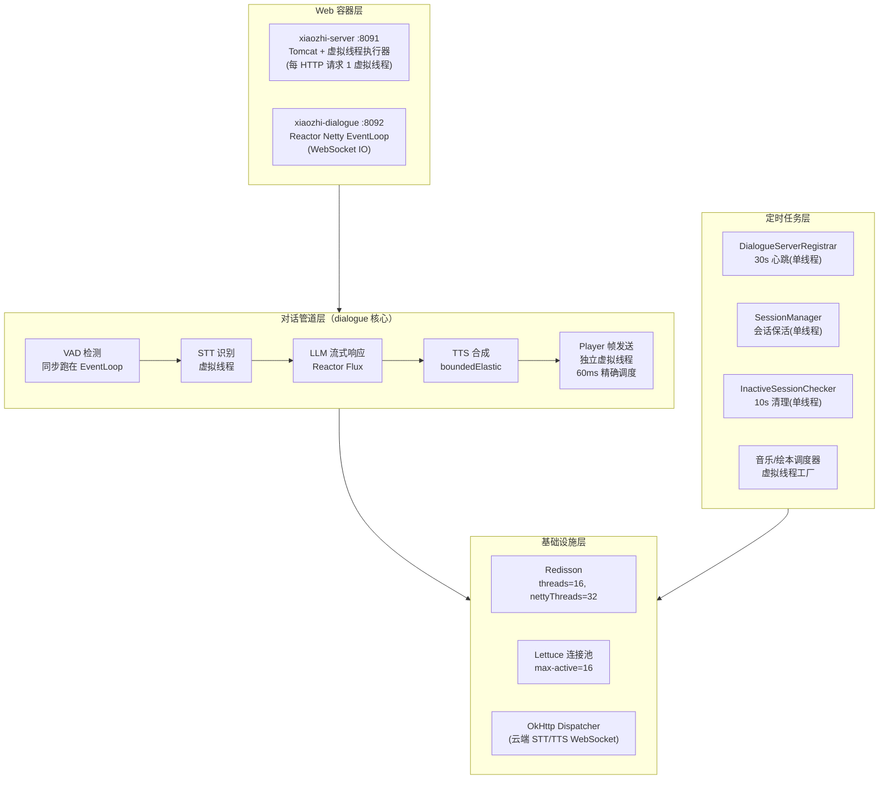

# 小智 ESP32 服务端 — 线程模型架构设计文档

> 版本：1.0　|　适用模块：xiaozhi-server / xiaozhi-dialogue / xiaozhi-ai
> 技术基线：Java 21（虚拟线程）、Spring Boot 3.5、Reactor Netty、Redisson

---

## 1. 设计目标

| 目标 | 约束 | 应对策略 |
|------|------|---------|
| 高并发设备会话 | dialogue 需支持海量设备 WebSocket 长连接 | 每 Session 独立虚拟线程，不预设线程数上限 |
| 实时音频时序 | Opus 帧须精确 60ms 间隔发送 | 绝对时间戳调度 + 虚拟线程纳秒级 sleep |
| JNI native 稳定性 | Vosk/ONNX 推理会 pin carrier 线程 | 隔离到固定大小平台线程池 |
| 管理后台吞吐 | REST API 以 DB/Redis I/O 为主 | Tomcat 协议层执行器整体虚拟线程化 |

## 2. 核心策略一句话

> **虚拟线程为主干（I/O 密集任务），平台线程池为特例（JNI native 场景），Reactor 响应式流贯穿 AI 管道，单线程调度器承担心跳/清理类周期任务。**

---

## 3. 总体架构图

### 3.1 分层视图



### 3.2 音频数据全链路线程迁移图

一条音频帧从设备到回复，经历 4 种线程环境：

```mermaid
sequenceDiagram
    participant DEV as ESP32 设备
    participant EL as Netty EventLoop
    participant VT as 虚拟线程(STT)
    participant BE as boundedElastic(TTS)
    participant PV as Player 虚拟线程

    DEV->>EL: 二进制 Opus 帧
    EL->>EL: VAD ONNX 推理(同步)

    alt SPEECH_START
        EL->>EL: 同步建音频流+切LISTENING(防竞态)
        EL->>VT: startVirtualThread(STT识别)
        VT->>VT: stream() 阻塞等待识别结果
        VT->>VT: Persona.chat() 触发 LLM
    else SPEECH_CONTINUE
        EL->>VT: 音频数据写入 Sinks Many
    end

    VT-->>BE: Flux&lt;Speech&gt; 订阅
    BE->>BE: PCM→Opus 编码，入队
    BE-->>PV: ConcurrentLinkedQueue 传递
    PV->>PV: Burst预缓冲 + 60ms绝对时间调度
    PV->>DEV: WebSocket 发送 Opus 帧
```

---

## 4. 分层线程模型详解

### 4.1 Web 容器层

**配置位置**：[ThreadConfig.java](../xiaozhi-server/src/main/java/com/xiaozhi/server/config/ThreadConfig.java) + `xiaozhi-server/application.yml`

| 配置项 | 值 | 作用 |
|--------|---|------|
| `spring.threads.virtual.enabled` | `true` | 全局开启虚拟线程 |
| `applicationTaskExecutor` Bean | `TaskExecutorAdapter(newVirtualThreadPerTaskExecutor())` | Spring MVC 异步请求（SSE 流式聊天） |
| `TomcatProtocolHandlerCustomizer` | 替换协议层执行器 | 每个 HTTP 请求分配一个虚拟线程 |
| `configureAsyncSupport` 超时 | 120s | 覆盖 SSE 60s 超时，防早断 |

```java
@Configuration
public class ThreadConfig {

    @Bean
    public AsyncTaskExecutor applicationTaskExecutor() {
        return new TaskExecutorAdapter(Executors.newVirtualThreadPerTaskExecutor());
    }

    @Bean
    public TomcatProtocolHandlerCustomizer<?> protocolHandlerVirtualThreadExecutorCustomizer() {
        return protocolHandler -> {
            protocolHandler.setExecutor(Executors.newVirtualThreadPerTaskExecutor());
        };
    }
}
```

### 4.2 对话管道层（4 种线程环境协作）

| 阶段 | 线程环境 | 关键代码位置 | 说明 |
|------|---------|-------------|------|
| VAD 检测 | Netty EventLoop（同步） | `DialogueService.processAudioData` | 单帧毫秒级推理，换取状态机时序确定性 |
| STT 启动 | 虚拟线程 | `DialogueService.startStt()` | 同步段建流，异步段识别，防竞态 |
| LLM 流式 | Reactor Flux | `Persona.chat()` → `ChatModel.stream()` | 各 LLM provider 用 `Flux.create(sink)` 桥接 |
| TTS 合成 | `Schedulers.boundedElastic()` | `ScheduledPlayer.subscribe()` | 每订阅独立弹性线程 |
| Player 发送 | 独立虚拟线程 | `ScheduledPlayer.play()` | 每 Session 一条，支持海量并发 |

### 4.3 定时调度层

| 类 | 调度器 | 周期 | 用途 |
|----|--------|------|------|
| `DialogueServerRegistrar` | 单线程 ScheduledExecutor | 30s | 实例心跳（Redis TTL 60s，容忍一次丢失） |
| `SessionManager` | 单线程 ScheduledExecutor | — | 会话保活 |
| `InactiveSessionChecker` | 单线程 ScheduledExecutor | 10s | 不活跃会话清理 |
| PlayMusic / PlayHuiBen / LocalMusicPlayer | `newScheduledThreadPool(CPU, Thread.ofVirtual().factory())` | 60ms 延迟 | 先返回工具响应再异步播放 |

### 4.4 平台线程池特例

| 类 | 池配置 | 原因 |
|----|--------|------|
| `VoskSttService.recognizerExecutor` | `newFixedThreadPool(CPU)` | JNI native 识别会 pin carrier，须平台线程隔离 |
| `AliyunTtsService.sharedExecutor` | `ThreadPoolExecutor(0,20,60s, SynchronousQueue)` 守护线程 | 弹性伸缩，无队列直接 hand-off |

两处均注册 JVM ShutdownHook 实现 5 秒优雅关闭。

### 4.5 基础设施层

| 组件 | 线程配置 | 承载内容 |
|------|---------|---------|
| Redisson（两模块） | `threads: 16, nettyThreads: 32` | 分布式锁、布隆过滤器 |
| Lettuce 池 | `max-active: 16` | 普通 Redis 命令 |
| Redis Pub/Sub | Lettuce I/O Netty 线程 → container taskExecutor | 跨实例事件广播（6 个频道复用 1 条独占订阅连接） |
| OkHttp Dispatcher | 默认 | 各云端 STT/TTS WebSocket 通道 |

---

## 5. 关键设计决策（ADR）

### ADR-1：为什么 Tomcat 请求处理用虚拟线程？

**决策**：通过 `TomcatProtocolHandlerCustomizer` 将协议层执行器替换为 `newVirtualThreadPerTaskExecutor()`。

**理由**：管理后台 REST API 是典型 I/O 密集型（DB 查询、Redis 读、外部 API 调用），虚拟线程在阻塞时 unmount carrier，不占用 OS 线程，单机吞吐量提升数倍。

**代价**：无连接数上限保护——虚拟线程"无限"，需依赖下游连接池（HikariCP、Lettuce）自身限流。

### ADR-2：为什么 VAD 在 EventLoop 上同步执行？

**决策**：`processAudioData` 不切换线程，直接在 Netty EventLoop 做 ONNX 推理。

**理由**：VAD 单帧推理毫秒级，且同步执行保证了 `SPEECH_START` → 建流 → 切换 `LISTENING` 状态与后续 `SPEECH_CONTINUE` 帧写入的**时序确定性**，规避跨线程竞态。

**风险**：若 VAD 模型变大或单机会话数极高，推理时间会累积挤占 IO 线程，届时需引入独立的推理线程池（见第 7 节）。

### ADR-3：为什么 STT 是"同步建流 + 虚拟线程识别"两段式？

**决策**（`DialogueService.startStt`）：

```
同步段（EventLoop 线程）：closeAudioStream → createAudioStream → transitionTo(LISTENING)
异步段（虚拟线程）：       发送初始音频 → STT 流式识别 → Persona.chat()
```

**理由**：若建流也异步，`SPEECH_CONTINUE` 帧可能在流就绪前到达导致丢帧。同步段保证状态先就位，异步段处理耗时识别。源码注释明确记录了这一动机。

### ADR-4：为什么 TTS 用 `boundedElastic` 而非 `single()`？

**决策**（`ScheduledPlayer.subscribe`，源码注释原文）：

```
single() 是全局唯一线程，多个 Player 并发时会相互串行阻塞；
boundedElastic 为每个订阅提供独立的弹性线程，适合 TTS 等含 I/O 阻塞的场景。
```

**理由**：TTS 包含网络 I/O（云端合成）与 CPU（Opus 编码），`boundedElastic` 默认 10×CPU 上限，按需创建，符合"阻塞型响应式任务"的标准归宿。

### ADR-5：为什么 Player 用独立虚拟线程 + 绝对时间调度？

**决策**（`ScheduledPlayer.sendFramesLoop`）：

```
targetSendTime = startTimestamp + playPosition
Thread.sleep(delayMs, delayNs)   // 等待到绝对时间点
playPosition += 60ms
```

**理由**：

1. **相对 sleep 有累积误差**（每次 sleep 的实际时长 ≥ 请求值），长回复会越拖越慢；绝对时间戳调度每帧独立校准。
2. **Burst 预缓冲**：`playPosition` 初始 -120ms，前 2 帧立即发送，设备即刻起播，避免首帧破音。
3. 虚拟线程的 `sleep` 是 unmount 而非阻塞 carrier，成千上万个 Player 并发时调度成本极低。

### ADR-6：为什么 Vosk 识别不用虚拟线程？

**决策**：JNI native 推理隔离到 `newFixedThreadPool(CPU)`。

**理由**：JDK 21 中虚拟线程进入 JNI/native 区域会 **pin 在 carrier 线程上无法 unmount**。若大量虚拟线程并发执行 Vosk 推理，会耗尽默认 carrier 池（=CPU 核数），导致整个 JVM 的虚拟线程调度僵死。固定 CPU 大小的平台线程池既控制并发度又天然背压。

> ⚠️ 注意：`VoskSttService` 类头注释写"使用 JDK 21 虚拟线程"，与实现不符，以实现为准（建议修正注释）。

### ADR-7：为什么音乐/绘本工具的调度器用虚拟线程工厂？

**决策**：

```java
Executors.newScheduledThreadPool(CPU,
    Thread.ofVirtual().name("music-scheduler-", 0).factory());
```

**理由**：`ScheduledThreadPoolExecutor` 的定时能力 + 虚拟线程的任务载体，兼具周期调度与轻量并发。工具调用须**先返回文本响应再开始播放**（60ms 延迟），避免阻塞 LLM 的 function call 返回。

---

## 6. 并发控制原语清单

| 原语 | 所在类 | 用途 |
|------|--------|------|
| `synchronized (fluxDisposable)` | ScheduledPlayer | 保护订阅切换/发送线程启动临界区 |
| `ConcurrentLinkedQueue<Speech>` | ScheduledPlayer | TTS 生产者与发送消费者解耦 |
| `ConcurrentLinkedQueue<Flux<Speech>>` | ScheduledPlayer | 多个 TTS 任务排队 |
| `AtomicReference<Disposable>` | ScheduledPlayer | 当前订阅无锁引用 |
| `volatile boolean running` | ScheduledPlayer | 发送线程停止标志 |
| `ConcurrentHashMap<String, SttService>` | SttServiceFactory | 服务实例缓存 |
| `AtomicBoolean` / `CountDownLatch` | 各 STT provider | 识别完成信号与一次性释放 |
| `ContextClosedEvent` 监听 | SessionManager | 停机标志先于 @PreDestroy 置位，防断链回调误写状态 |

---

## 7. 风险与演进建议

| 风险点 | 影响 | 建议 |
|--------|------|------|
| VAD 推理占用 EventLoop | 极高会话数下 IO 线程饥饿 | 引入独立推理线程池，或改用 `publishOn` 切线程 |
| Tomcat 虚拟线程无上限 | 突发流量打满下游连接池 | 网关层限流 + HikariCP `connection-timeout` 兜底 |
| Vosk 类注释与实现不一致 | 误导后续维护 | 修正注释为"平台线程池执行 native 识别" |
| Player 结束检测靠 120ms 双检 | 极端时序下 stop 消息早/晚发 | 可改为显式完成信号（`Flux.doFinally` 通知发送线程） |

---

## 8. 决策速查矩阵

| 任务特征 | 线程选择 | 项目内代表 |
|---------|---------|-----------|
| HTTP 请求（I/O 密集） | 虚拟线程（Tomcat 执行器） | 全部 REST API |
| 一次性 I/O 阻塞任务 | `Thread.startVirtualThread` | STT、状态写库、MCP 初始化 |
| 响应式流中的阻塞环节 | `Schedulers.boundedElastic()` | TTS 合成 |
| 需要顺序保证的单流 | `Schedulers.single()` | Xfyun 音频发送 |
| JNI native 计算 | 固定大小平台线程池 | Vosk 识别 |
| 低频周期任务 | 单线程 ScheduledExecutor | 心跳、会话清理 |
| 精确间隔 + 高并发 | 独立虚拟线程 + 绝对时间 sleep | Player 60ms 帧调度 |
